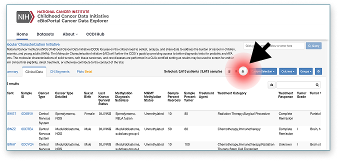
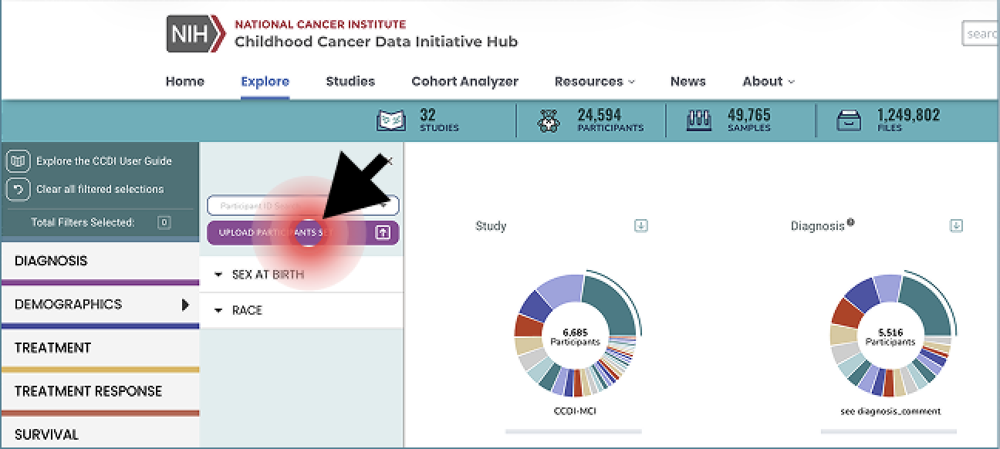

## Data Use Expectations
Users of the data must explicitly agree not to attempt to re-identify patients and cannot redistribute the data without express written permission from the CCDI leadership <a href="ncichildhoodcancerdatainitiative@mail.nih.gov"> (ncichildhoodcancerdatainitiative@mail.nih.gov)</a>.

## How to View Underlying Raw Data in the CCDI Hub

To explore the underlying sequencing, imaging, or other raw data associated with participants from cBioPortal, first download the Clinical Data file from the Clinical Data tab in cBioPortal. From the downloaded file, extract the Patient ID column.

    

        

            

                
            

        

        

            

                
            

        

    

<!-- 
 -->

In the CCDI Hub Explore dashboard, open the Demographics facet, click Upload Participants Set, and upload the file containing only the Patient IDs from cBioPortal.

    

        

            

                
            

        

        

            

                
            

        

    

<!-- 
 -->

## Citing the CCDI cBioPortal

When using data accessed through the CCDI cBioPortal in presentations or manuscripts, please acknowledge the source as follows:

*"The results analyzed and &lt;published or shown&gt; here are based in whole or in part on data accessed through the CCDI cBioPortal, established by the Childhood Cancer Data Initiative (CCDI)."*
